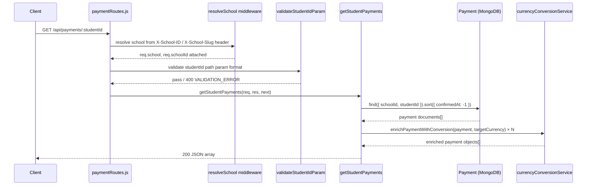

# Design Document: Student Payment History

## Overview

This feature exposes a read-only API endpoint that returns the complete payment history for a specific student, scoped to the requesting school. The endpoint already has a partial implementation (`getStudentPayments` in `paymentController.js`); this design formalises the contract, identifies gaps, and specifies the query, enrichment, validation, and error-handling behaviour that must be in place.

The endpoint is:

```
GET /api/payments/:studentId
```

It is already registered in `paymentRoutes.js` behind the `resolveSchool` middleware and the `validateStudentIdParam` middleware, so school-scoping and input validation are handled at the routing layer.

---

## Architecture

The feature sits entirely within the existing Express/MongoDB backend. No new infrastructure is required.



### Key Design Decisions

- **School-scoping via middleware**: `resolveSchool` injects `req.schoolId` before the controller runs. The controller always includes `schoolId` in the MongoDB query filter — this is the primary multi-tenancy guard.
- **Graceful currency degradation**: `enrichPaymentWithConversion` never throws; when the CoinGecko price feed is unavailable it returns `localCurrency.available: false` with null amounts. The payment record is still returned.
- **No pagination by default**: The endpoint returns all records for a student. Students are unlikely to have thousands of payments, so a full result set is acceptable. Pagination can be added later if needed.
- **Lean queries**: `.lean()` is used on the Mongoose query to return plain JS objects, which are cheaper to serialise and safe to spread when attaching `explorerUrl` and `localCurrency`.

---

## Components and Interfaces

### Route

```
GET /api/payments/:studentId
Headers: X-School-ID or X-School-Slug (required)
```

Middleware chain (already in place):
1. `resolveSchool` — resolves `req.school` and `req.schoolId`
2. `validateStudentIdParam` — rejects `studentId` values that don't match `/^[A-Za-z0-9_-]{3,20}$/`
3. `getStudentPayments` — controller handler

### Controller: `getStudentPayments`

Located in `backend/src/controllers/paymentController.js`.

Responsibilities:
- Query `Payment` collection with `{ schoolId: req.schoolId, studentId: req.params.studentId }`, sorted by `confirmedAt` descending.
- For each payment, call `enrichPaymentWithConversion(payment, targetCurrency)` where `targetCurrency = req.school.localCurrency || 'USD'`.
- Return the enriched array as JSON with HTTP 200 (empty array if no records found).
- Pass unexpected errors to `next(err)` for the global error handler.

### Service: `enrichPaymentWithConversion`

Located in `backend/src/services/currencyConversionService.js`.

Takes a payment object and a target currency string. Returns a new object (non-mutating spread) with two additional fields:
- `explorerUrl` — Stellar explorer link derived from `transactionHash || txHash`
- `localCurrency` — `{ amount, currency, rate, rateTimestamp, available }`

### Model: `Payment`

Located in `backend/src/models/paymentModel.js`.

Relevant indexes already present:
- `{ schoolId: 1, studentId: 1, confirmedAt: -1 }` — covers the exact query pattern used by this endpoint.

---

## Data Models

### Payment Record (response shape per item)

| Field                | Type            | Notes |
|----------------------|-----------------|-------|
| `_id`                | string          | MongoDB ObjectId |
| `studentId`          | string          | Matches the path param |
| `txHash`             | string          | Stellar transaction hash |
| `amount`             | number          | Amount paid in asset units |
| `feeAmount`          | number \| null  | Required fee at time of payment |
| `feeValidationStatus`| string          | `valid` \| `overpaid` \| `underpaid` \| `unknown` |
| `excessAmount`       | number          | Amount above required fee |
| `status`             | string          | `PENDING` \| `SUBMITTED` \| `SUCCESS` \| `FAILED` |
| `memo`               | string          | Memo used in the Stellar transaction |
| `senderAddress`      | string \| null  | Stellar address of the sender |
| `isSuspicious`       | boolean         | Fraud flag |
| `suspicionReason`    | string \| null  | Reason for suspicion flag |
| `ledger`             | number \| null  | Stellar ledger sequence |
| `confirmationStatus` | string          | `pending_confirmation` \| `confirmed` \| `failed` |
| `confirmedAt`        | ISO string \| null | Ledger close time |
| `verifiedAt`         | ISO string \| null | Time of API verification |
| `createdAt`          | ISO string      | Record creation time |
| `updatedAt`          | ISO string      | Last update time |
| `explorerUrl`        | string \| null  | Added by enrichment; links to Stellar explorer |
| `localCurrency`      | object          | Added by enrichment (see below) |

### `localCurrency` sub-object

| Field          | Type            | Notes |
|----------------|-----------------|-------|
| `amount`       | number \| null  | Converted amount; null if unavailable |
| `currency`     | string          | ISO 4217 code, e.g. `"USD"` |
| `rate`         | number \| null  | Exchange rate used |
| `rateTimestamp`| string \| null  | ISO timestamp of rate fetch |
| `available`    | boolean         | `false` when price feed is down |

### MongoDB Query

```js
Payment
  .find({ schoolId: req.schoolId, studentId: req.params.studentId })
  .sort({ confirmedAt: -1 })
  .lean()
```

This query is covered by the compound index `{ schoolId: 1, studentId: 1, confirmedAt: -1 }`.

---

## Correctness Properties

*A property is a characteristic or behavior that should hold true across all valid executions of a system — essentially, a formal statement about what the system should do. Properties serve as the bridge between human-readable specifications and machine-verifiable correctness guarantees.*

### Property 1: Query correctness — filter and sort

*For any* school and student with one or more payment records, querying `GET /api/payments/:studentId` must return only records where both `studentId` equals the path parameter and `schoolId` equals the resolved school, and those records must be ordered by `confirmedAt` descending (most recent first).

**Validates: Requirements 1.1, 3.3, 3.4**

---

### Property 2: Invalid studentId is rejected

*For any* string that does not match the pattern `^[A-Za-z0-9_-]{3,20}$` (e.g. too short, too long, contains illegal characters), the API must respond with HTTP 400 and a `VALIDATION_ERROR` code.

**Validates: Requirements 1.3**

---

### Property 3: Cross-school isolation

*For any* two distinct schools A and B that each have payment records for a student with the same `studentId`, querying the endpoint with school A's context must never return any record whose `schoolId` is school B's identifier.

**Validates: Requirements 1.4, 3.1**

---

### Property 4: Completeness — all records returned

*For any* student with N payment records in the database (for a given school), the API response must contain exactly N items (assuming no pagination parameters are applied).

**Validates: Requirements 3.2**

---

### Property 5: Response shape integrity

*For any* payment record returned by the endpoint:
- All required fields must be present: `studentId`, `txHash`, `amount`, `feeAmount`, `feeValidationStatus`, `excessAmount`, `status`, `memo`, `senderAddress`, `isSuspicious`, `suspicionReason`, `ledger`, `confirmationStatus`, `confirmedAt`, `verifiedAt`, `createdAt`, `updatedAt`.
- When `transactionHash` or `txHash` is non-null, `explorerUrl` must be a non-null string containing that hash value.
- A `localCurrency` object must be present with the fields `amount`, `currency`, `rate`, `rateTimestamp`, and `available`; when the price feed is unavailable, `available` must be `false` and `amount` must be `null`.

**Validates: Requirements 2.1, 2.2, 2.3, 2.4**

---

### Property 6: No internal error details in error responses

*For any* error scenario (invalid input, DB failure, missing school context), the response body must not contain raw stack traces, Mongoose error internals, or database connection strings.

**Validates: Requirements 4.3**

---

## Error Handling

| Scenario | HTTP Status | Code | Handler |
|---|---|---|---|
| Missing `X-School-ID` / `X-School-Slug` header | 400 | `MISSING_SCHOOL_CONTEXT` | `resolveSchool` middleware |
| School not found or inactive | 404 | `SCHOOL_NOT_FOUND` | `resolveSchool` middleware |
| `studentId` fails regex validation | 400 | `VALIDATION_ERROR` | `validateStudentIdParam` middleware |
| No payments found for student | 200 | — | Controller returns `[]` |
| MongoDB query throws | 500 | `INTERNAL_ERROR` | `next(err)` → global error handler |

The global error handler (`backend/src/middleware/errorHandler.js`) is responsible for stripping stack traces from production responses. The controller must not catch unexpected errors itself — it passes them to `next(err)`.

---

## Testing Strategy

### Unit Tests

Focus on specific examples and edge cases:

- **Empty result**: student exists but has no payments → response is `[]` with 200.
- **Currency service unavailable**: mock `enrichPaymentWithConversion` to return `localCurrency.available: false` → request still succeeds with 200.
- **Missing school header**: no `X-School-ID` header → 400 `MISSING_SCHOOL_CONTEXT`.
- **DB error propagation**: mock `Payment.find` to throw → error is passed to `next`, not swallowed.
- **explorerUrl generation**: payment with `transactionHash` set → `explorerUrl` contains the hash.

### Property-Based Tests

Use a property-based testing library (e.g. **fast-check** for Node.js). Each test runs a minimum of **100 iterations**.

Each test must be tagged with a comment in the format:
`// Feature: student-payment-history, Property <N>: <property_text>`

**Property 1 — Query correctness**
Generate a random `schoolId`, `studentId`, and array of payment documents. Insert them, query the endpoint, and assert every returned record has the correct `studentId` and `schoolId`, and that `confirmedAt` values are non-increasing.
`// Feature: student-payment-history, Property 1: returned records match filter and are sorted by confirmedAt desc`

**Property 2 — Invalid studentId rejected**
Generate random strings that violate `^[A-Za-z0-9_-]{3,20}$` (too short, too long, special chars). Assert each produces HTTP 400 with `VALIDATION_ERROR`.
`// Feature: student-payment-history, Property 2: invalid studentId format returns 400 VALIDATION_ERROR`

**Property 3 — Cross-school isolation**
Generate two distinct `schoolId` values and a shared `studentId`. Insert payments for both schools. Query with school A's context and assert no returned record has `schoolId` equal to school B.
`// Feature: student-payment-history, Property 3: school B payments never appear in school A results`

**Property 4 — Completeness**
Generate N random payment records for a student. Insert all N. Query and assert `response.length === N`.
`// Feature: student-payment-history, Property 4: all N inserted payments are returned`

**Property 5 — Response shape integrity**
Generate random payment records (with and without `transactionHash`, with and without currency service available). Assert every item in the response has all required fields, correct `explorerUrl` behaviour, and a well-formed `localCurrency` object.
`// Feature: student-payment-history, Property 5: every returned record has required fields, explorerUrl, and localCurrency`

**Property 6 — No stack traces in error responses**
Generate error scenarios (bad input, mocked DB failure). Assert the response body string does not contain `"stack"`, `"at "`, or `"Error:"` patterns.
`// Feature: student-payment-history, Property 6: error responses contain no stack traces or internal details`
